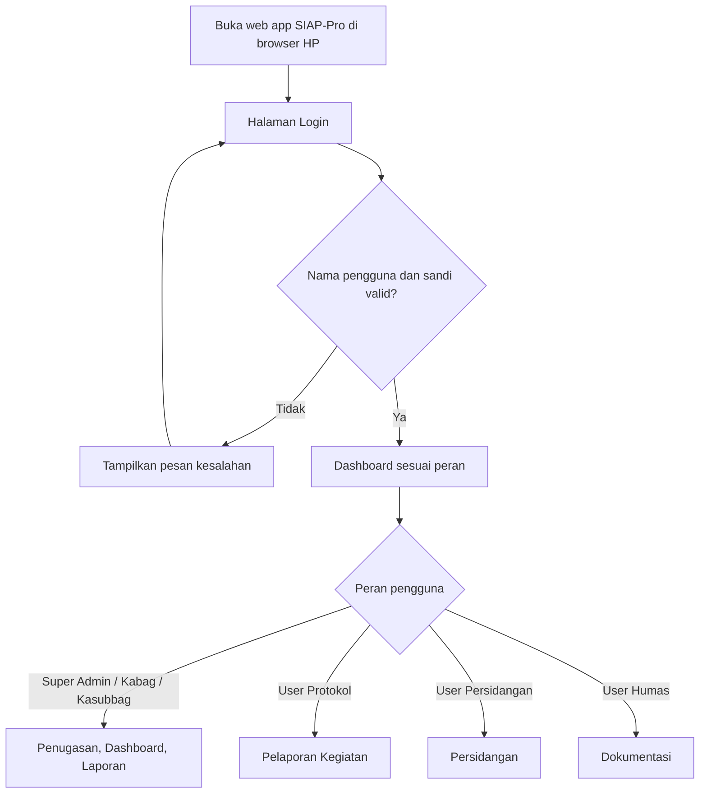
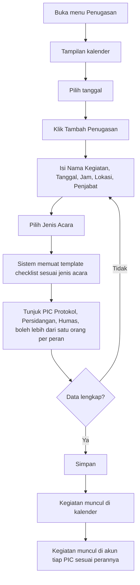
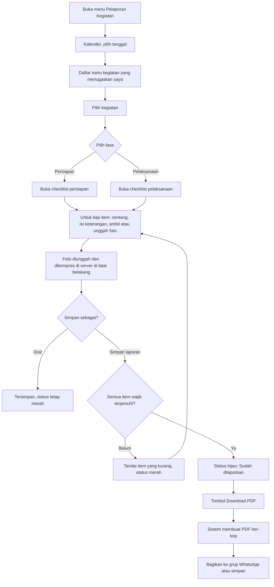
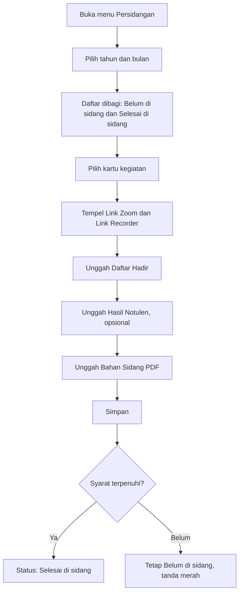
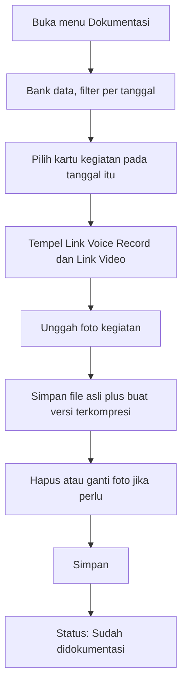
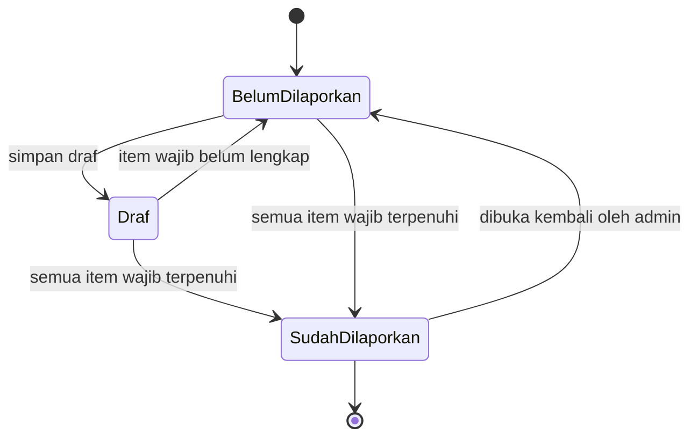
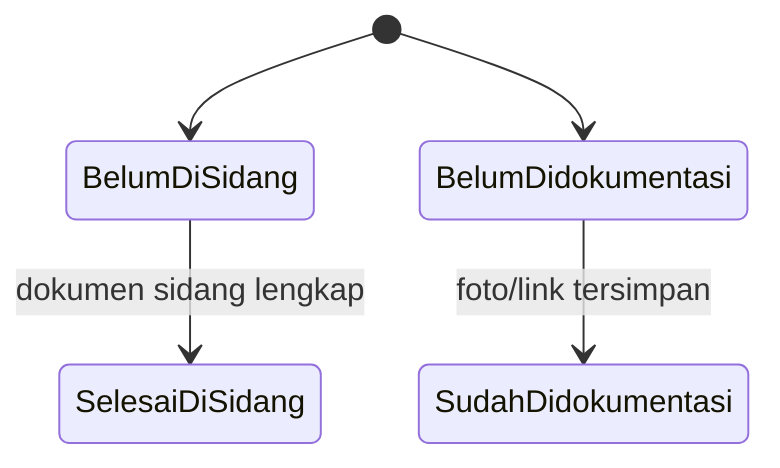

# User Flow — SIAP-Pro (Sistem Aplikasi Protokol)

**Versi 2.0 (Draft)** · 30 September 2026 · Pasangan dari `PRD_SIAP-Pro_v2.md`

Penanda: **[Rekaman]**, **[Manual]**, **[Laporan]** = ada di sumber; **[Usulan]** = rekomendasi penyusun; **[OQ-n]** = pertanyaan terbuka di PRD Bagian 12.

---

## 1. Alur Global

- Menu di luar peran **tidak ditampilkan**, dan akses URL langsung ditolak di server. [Rekaman][Usulan]
- Dashboard menampilkan 4 indikator dan Akses Cepat. [Manual]

## 2. Alur Penugasan (Super Admin / Kabag / Kasubbag)

- Jenis Acara menentukan checklist. [Rekaman]
- Ubah jadwal, ganti PIC, dan batalkan kegiatan tercatat di audit log. [Usulan]
- PIC melihat jadwal di akunnya sebagai "scheduling" pribadi; tanggal bertanda merah berarti belum lapor. [Rekaman]

## 3. Alur Pelaporan Persiapan dan Pelaksanaan (User Protokol)

Detail:

- Status hijau/merah berlaku **per fase**. [Rekaman]
- Persiapan dilaporkan sebelum acara; batas waktu dan pengingat menunggu [OQ-1].
- Peringatan jika foto identik dipakai di item berbeda dalam satu laporan. [Usulan]
- Sinyal buruk: unggahan masuk antrean dan dicoba ulang otomatis. [Usulan]
- Catatan Kabag/Kasubbag tampil di kartu kegiatan (hanya baca untuk PIC). [Manual][OQ-7]
- Laporan Pelaksanaan: format PDF belum ada [OQ-2].

## 4. Alur Persidangan (User Persidangan)

- Notulen berupa **file yang diunggah**, bukan diketik; boleh kosong. [Rekaman]
- Kartu hanya muncul untuk kegiatan yang menugaskan user. [Rekaman]
- Syarat "Selesai di sidang" menunggu keputusan [OQ-9].

## 5. Alur Dokumentasi (User Humas)

- Filter **per tanggal**, karena modul berfungsi sebagai "Google Drive" foto. [Rekaman]
- File asli disimpan dan versi ≤ 1 MB dibuat untuk tampilan/PDF. Ini menggantikan "Max 1MB" di flow lama. [Usulan][OQ-4]

## 6. Alur Evaluasi Kegiatan

**Belum bisa digambar.** Modul Evaluasi ada di Dashboard dan Akses Cepat [Manual], tetapi tidak ada isi atau langkahnya di sumber. Menunggu [OQ-6].

## 7. Diagram Status

### 7.1 Status Laporan (per fase)

Warna: `BelumDilaporkan` = merah, `SudahDilaporkan` = hijau. [Rekaman]
"Dibuka kembali oleh admin" dan aturan edit setelah simpan adalah [Usulan].

### 7.2 Status Persidangan dan Dokumentasi

## 8. Skenario Pengecualian [Usulan]

| Situasi | Perilaku sistem |
|---|---|
| Login salah | Pesan error umum, tetap di halaman login |
| Sesi habis | Diarahkan ke login; draf lokal tidak hilang |
| Sinyal putus saat unggah | Masuk antrean, coba ulang otomatis, tampil indikator "belum terkirim" |
| Foto terlalu besar | Pesan jelas dengan batas ukuran |
| Foto yang sama dipakai dua item | Peringatan sebelum simpan |
| Item wajib kosong saat simpan | Item ditandai, laporan tetap merah |
| PIC diganti setelah ada laporan | Laporan lama tetap milik pembuat awal; PIC baru dapat melanjutkan |
| Kegiatan dibatalkan | Hilang dari daftar aktif, tetap ada di arsip |
| User membuka URL modul tanpa hak | Ditolak (403) |
| Template checklist diubah | Laporan lama tidak berubah |

## 9. Ringkasan Perubahan dari User Flow v1

1. Menambah peran Kabag/Kasubbag dan alur multi-PIC.
2. Memisahkan laporan **Persiapan** dan **Pelaksanaan** dengan status hijau/merah per fase.
3. Menambah alur pemilihan **Jenis Acara** dan pemuatan template checklist.
4. Kompresi foto dipindah ke pemrosesan asinkron di server dan file asli disimpan.
5. Menambah langkah **Bagikan ke WhatsApp** setelah unduh PDF.
6. Menambah skenario error, status, dan sinyal lemah.
7. Menandai modul Evaluasi sebagai belum terdefinisi.
